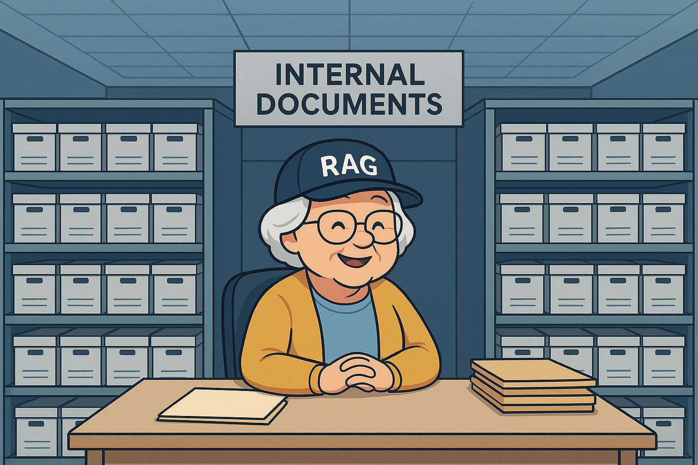

# rt-aaidc-project1


*Banner generated by ChatGPT*

## Project baseed on:
https://app.readytensor.ai/hubs/ready_tensor_certifications
The project was created as a result of mastering the knowledge from the first module of the course.


## 📌 Project Description
**rt-aaidc-project1** is a **RAG (Retrieval-Augmented Generation)** system that allows users to ask questions and receive answers based on internal documents stored in a vector database.  
The goal of this project is to demonstrate a practical application of the RAG technique using custom data.

---

## ⚙️ Technologies
- **Python 100%**

---

## 🚀 How to Run the Project

1. **Clone the repository**
   ```bash
   git clone https://github.com/your-username/rt-aaidc-project1.git
   cd rt-aaidc-project1
   ```

2. **Upload your documents**  
   Place your `.pdf` or `.txt` files into the `data/` directory (or another configured folder).

3. **Create and activate a virtual environment (optional but recommended)**
   ```bash
   python -m venv venv
   source venv/bin/activate   # Linux / Mac
   venv\Scripts\activate      # Windows
   ```

4. **Install required dependencies**
   ```bash
   pip install -r requirements.txt
   ```

5. **Configure your API key (if required)**  
   Copy `.env.example` to `.env` and add your API key, for example:
   ```
   OPENAI_API_KEY=your_key_here
   ```

6. **Run the project**
   ```bash
   python main.py
   ```

---

## 📁 Project Structure
```
rt-aaidc-project1/
├── src/
│   ├── app.py        # Main RAG application
│   └── vectordb.py   # Vector database wrapper
├── data/             # Place your documents here
│   ├── *.txt / *.pdf
├── requirements.txt  # Dependencies
├── .env.example      # Environment variables template
└── README.md         # Project documentation
|_  banner.png  
```

---
